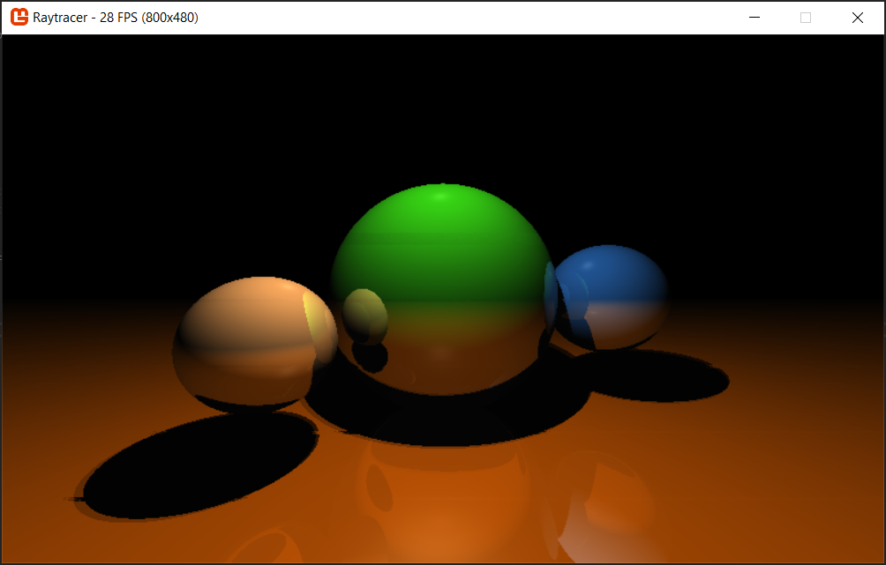

# C# Raytracer

A raytracer built with Monogame and .Net Core.

:warning: WIP

Initial working software tracer with basic reflective surfaces and simple soft shadows:

___

There are multiple backend implementations that can be swapped out on the fly:

* single-threaded software-based
* multi-threaded software-based (same logic but makes use of multiple cores)
* compute shader based (using the [MonoGame Core](https://www.nuget.org/packages/MonoGame.Framework.DesktopGL.Core) fork)

Each implementation uses the same logic to determine resolution:

Given a resolution it will attempt to hit the configured FPS target (e.g. 60 FPS), failing to do so it will half the resolution.

This will cause the images to become blurrier until all movement is stopped and it can upscale again.

For CPU based tracing this behaviour can be observed at almost all (decent) resolutions as CPUs aren't powerful enough for realtime raytracing.

# Features

* configuration options (currently limited to file/command line based at startup)
* simple reflective colored surfaces
* hard/soft shadows (`sampleCount` = 1 for hard, larger number for softer shadows)

# Known issues

* purple screen when using compute shader on mobile chipsets (Intel Graphics 6xx and the likes). The shader simply doesn't run/output anything resulting in the default texture color (purple) being shown

TODO:

* multiple surface types
* GPU-based (vertex/pixel shader)
* load scene from file
* GUI overlay to edit configuration values on the fly
* performance test/tracing
* use [ShaderGen](https://github.com/mellinoe/ShaderGen) to share raytracing core across compute/software shader

# Sources

* [Ray tracing with OpenGL Compute Shaders ](https://github.com/LWJGL/lwjgl3-wiki/wiki/2.6.1.-Ray-tracing-with-OpenGL-Compute-Shaders-%28Part-I%29)
* [Ray tracing in one weekend](http://in1weekend.blogspot.com/2016/01/ray-tracing-in-one-weekend.html)
* [veldrid-raytracer](https://github.com/mellinoe/veldrid-raytracer)
* [Paul Bourke](paulbourke.net/miscellaneous/raytracing/)
* [An Introduction to Compute Shaders](http://antongerdelan.net/opengl/compute.html)