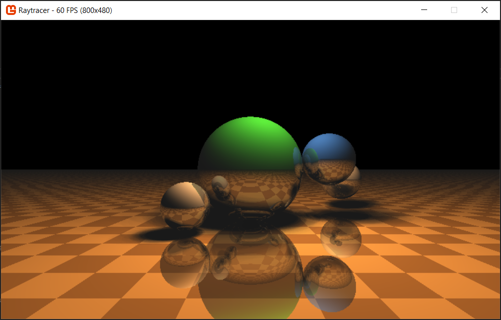

# C#/Compute Shader Raytracer

A raytracer built with Monogame and .Net Core. Also includes a custom compute shader extension I wrote for monogame!

Realtime compute shader based raytracer with reflections, colored surfaces and soft shadows:



[](https://dev.azure.com/marcstanlive/Opensource/_build/definition?definitionId=44)
___

# Setup

Built with Visual Studio 2019 and .Net Core 3.1.

The compute shader implementation is in its [own repository](https://github.com/MarcStan/monogame-framework-computeshader) and referenced via a git submodule. Therefore you must run:

```
git submodule init && git submodule update
```

after checkout to build the solution successfully.

# Details

There are multiple alternative backend implementations that can be swapped out via configuration:

* compute shader based (using the [MonoGame Core](https://www.nuget.org/packages/MonoGame.Framework.DesktopGL.Core) fork)
* single-threaded software-based
* multi-threaded software-based (same logic as single-threaded but makes use of multiple cores)

Each implementation uses the same logic to determine resolution:

Given a resolution it will attempt to hit the configured FPS target (e.g. 60 FPS), failing to do so it will half the resolution.

This will cause the images to become blurrier until all movement is stopped and it can upscale again.

For CPU based tracing this behaviour can be observed at almost all (decent) resolutions (even without soft shadows and reflections) as CPUs aren't powerful enough for realtime raytracing.

# Features

* configuration options (currently limited to file/command line based at startup)
* simple reflective colored & checkerboard surfaces
* hard/soft shadows (`sampleCount` = 1 for hard, larger number for softer shadows)
* configurable reflection depth limit (0 = no reflections)
* player movement (WASD + mouse, configurable)
* sphere movement in scene

# Known issues

* purple screen when using compute shader on mobile chipsets (Intel Graphics 6xx and the likes). The shader simply doesn't run/output anything resulting in the default texture color (purple) being shown
* AccessViolationException on linkProgram on mobile chipsets (Intel Graphis 6xx and the likes)

# possible future TODOs:

* GPU-based (vertex/pixel shader) (purposefully avoided for now as it requires installing the monogame content pipeline and would just be a copy paste job of the compute shader)
* load scene from file
* GUI overlay to edit configuration values on the fly
* performance test/tracing
* use [ShaderGen](https://github.com/mellinoe/ShaderGen) to share raytracing core across compute/software shader

# Sources

* [Ray tracing with OpenGL Compute Shaders](https://github.com/LWJGL/lwjgl3-wiki/wiki/2.6.1.-Ray-tracing-with-OpenGL-Compute-Shaders-%28Part-I%29)
* [Ray tracing in one weekend](http://in1weekend.blogspot.com/2016/01/ray-tracing-in-one-weekend.html)
* [veldrid-raytracer](https://github.com/mellinoe/veldrid-raytracer)
* [Paul Bourke](http://paulbourke.net/miscellaneous/raytracing/)
* [An Introduction to Compute Shaders](http://antongerdelan.net/opengl/compute.html)